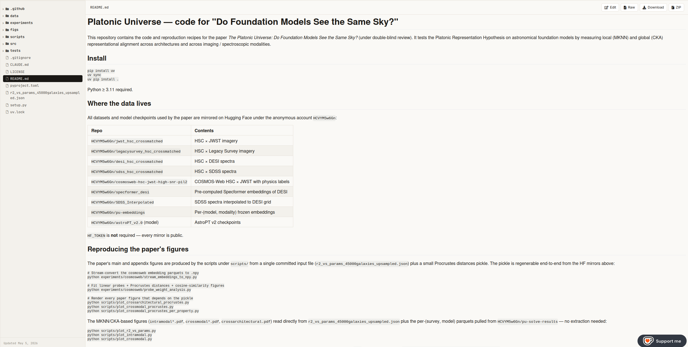

# Platonic Universe — code for "Do Foundation Models See the Same Sky?"

This repository contains the code and reproduction recipes for the paper
*The Platonic Universe: Do Foundation Models See the Same Sky?*
(under double-blind review). It tests the Platonic Representation
Hypothesis on astronomical foundation models by measuring local (MKNN)
and global (CKA) representational alignment across architectures and
across imaging / spectroscopic modalities.

## Step 1 — Download the code

In the top right of the anonymous.4open.science page you will see a
**ZIP** button:



Click it. It downloads `<repo>.zip`. Unzip it and `cd` into the unzipped
folder.

## Step 2 — Install

Install `uv` (fast Python package manager) — see the official
instructions at <https://docs.astral.sh/uv/getting-started/installation/>.
Then, from the repo root:

```
uv sync
uv pip install .
```

Python ≥ 3.11 required. No HF login or token is needed — every dataset
mirror is public.

## Step 3 — Reproduce the paper's figures

These instructions assume a Linux or macOS environment (on Windows, use
WSL).

There are two scripts. Run the quick one first to confirm your install
works; then the full one for the figures that need a Hugging Face
download.

### Step 3a — Quick figures (~30 seconds, no downloads)

```
chmod +x reproduce_quick.sh
./reproduce_quick.sh
```

Renders every paper figure that depends only on the committed input
file `r2_vs_params_45000galaxies_upsampled.json`. Output appears in
`figs/`. If this works you know the install is correct.

### Step 3b — Full reproduction (~30 GB download, ~30 minutes)

```
chmod +x reproduce_full.sh
./reproduce_full.sh
```

`reproduce_full.sh` first re-runs the quick script for completeness,
then streams ~30 GB of cosmosweb embeddings from Hugging Face, fits
linear probes, computes the Procrustes distance pickle and cosine
similarity matrices, and renders the remaining figures.

(Or skip `chmod` and run `bash reproduce_quick.sh` / `bash reproduce_full.sh`.)

## What each script does

### `reproduce_quick.sh`

| Plotter | Output (`figs/...`) | Paper |
|---|---|---|
| `plot_r2_vs_params.py` | `r2_vs_params.pdf` | Fig 1 |
| `plot_r2_vs_params_per_property.py` | `r2_vs_params_per_property.pdf` | App. (Fig r2vsparams) |
| `plot_intramodal.py` | `intramodal.pdf`, `intramodal_cka.pdf` | Fig 5 |
| `plot_intramodal_per_property.py` | `intramodal_*_per_property.pdf` | App. (Figs intramodal_z, _mass, _ssfr) |
| `plot_crossmodal.py` | `crossmodal*.pdf` (4 files) | Fig 6 + variants |
| `plot_crossmodal_per_property.py` | `crossmodal_*_per_property.pdf` | App. (Figs crossmodal_z, _mass, _ssfr) |

### `reproduce_full.sh` (additionally)

| Step / plotter | Output | Paper |
|---|---|---|
| `experiments/cosmosweb/stream_embeddings_to_npy.py` | local `.npy` cache | (intermediate) |
| `experiments/cosmosweb/probe_weight_analysis.py` | `procrustes_distances_*.pkl` + `avg_cosine_similarity_*.pdf` + per-model cosine matrices | Fig 4, App. (Figs cos1, cos2) |
| `scripts/plot_crossarchitectural_procrustes.py` | `crossarchitectural_procrustes.pdf` | Fig 2 |
| `scripts/plot_crossmodal_procrustes.py` | `crossmodal_procrustes.pdf` | (supporting) |
| `scripts/plot_crossmodal_procrustes_per_property.py` | `crossmodal_procrustes_per_property_ancova.pdf` | Fig 3 |

## Where the data lives

All datasets and model checkpoints used by the paper are mirrored on
Hugging Face under the anonymous account `HCVYM5w6Gn`. They are pulled
automatically by `reproduce_full.sh`; you do not need to download
anything by hand.

| Repo | Contents |
|---|---|
| `HCVYM5w6Gn/jwst_hsc_crossmatched` | HSC × JWST imagery |
| `HCVYM5w6Gn/legacysurvey_hsc_crossmatched` | HSC × Legacy Survey imagery |
| `HCVYM5w6Gn/desi_hsc_crossmatched` | HSC × DESI spectra |
| `HCVYM5w6Gn/sdss_hsc_crossmatched` | HSC × SDSS spectra |
| `HCVYM5w6Gn/cosmosweb-hsc-jwst-high-snr-pil2` | COSMOS-Web HSC × JWST with physics labels |
| `HCVYM5w6Gn/specformer_desi` | Pre-computed Specformer embeddings of DESI |
| `HCVYM5w6Gn/SDSS_Interpolated` | SDSS spectra interpolated to DESI grid |
| `HCVYM5w6Gn/pu-embeddings` | Per-(model, modality) frozen embeddings |
| `HCVYM5w6Gn/astroPT_v2.0` (model) | AstroPT v2 checkpoints |

## Layout

```
src/pu/                package: model adapters, dataset adapters, metrics, CLI
experiments/cosmosweb/  cosmosweb embedding extraction + probe analysis
experiments/platonic/   crossmatched-survey solve / UMAP pipeline
scripts/                figure plotters
tests/                  unit tests
reproduce_quick.sh      Step 3a
reproduce_full.sh       Step 3b
```

## License

AGPLv3.
